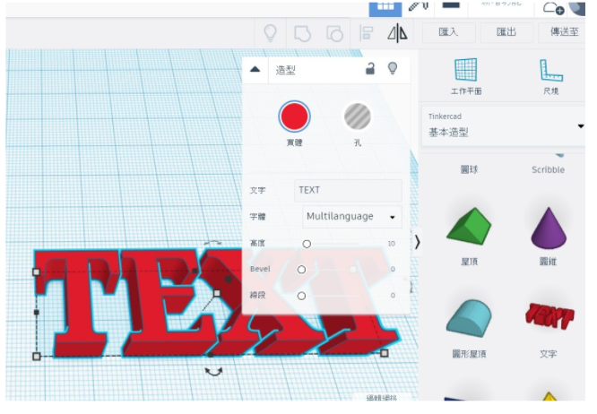

# TinkerCAD 介紹

### 👉 操作介面

### 👉 滑鼠按鍵

### 👉 **設定網格單位及圖面大小**

### 👉 **匯入檔案**

### 👉 **設定鎖點格線單位**

### 👉 **左鍵拖曳載入物件**

### 👉 **調整比例**

### 👉 **調整高度/升降**

### 👉 **旋轉物件**

### 👉 **複製、貼上**

### 👉 **重複、刪除**

### 👉 **隱藏**

### 👉 **解除隱藏**

### 👉 **『孔』型式**

### 👉 **鎖定編輯**

### 👉 **對齊**

### 👉 **群組**

### 👉 **取消群組**

### 👉 **鏡射**

### 👉 **尺規**

### 👉 **變更工作平面**

### 👉 **鎖住編輯**

### 👉 **貼平面**

### 👉 **鎖住編輯**

### 👉 **鎖住編輯** 

